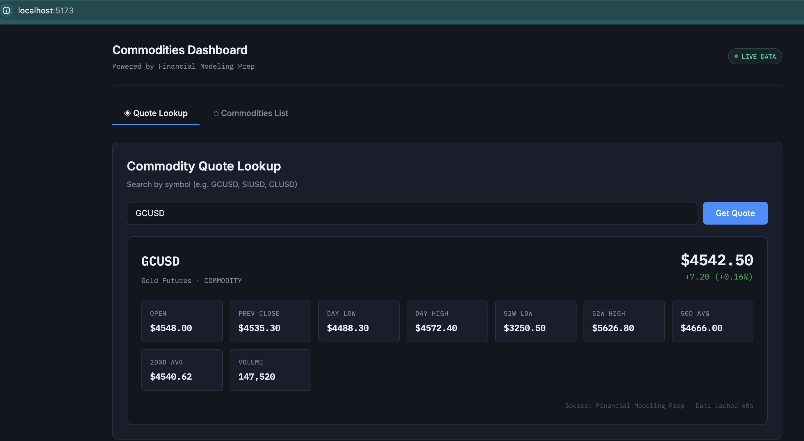
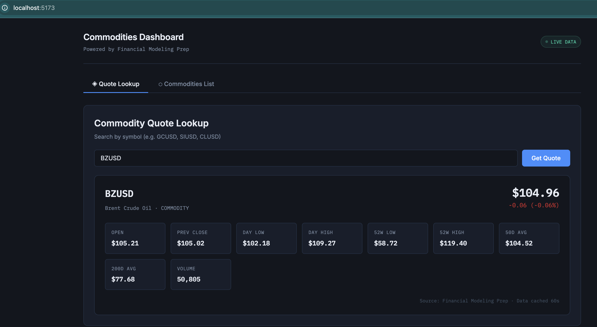
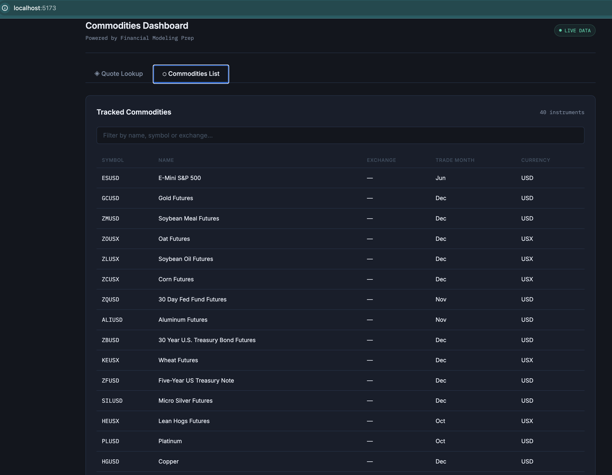

A Spring Boot REST API that fetches real-time commodity quotes and a list of the tracked commodities across various sectors (energy, metals, agriculture) from Financial Modeling Prep (FMP) and serves them via a clean JSON response. 
Built as the backend layer for a commodities dashboard.

## Tech Stack
- **Backend**: Java 21, SpringBoot 3.5, Spring Web, Spring Cache, Lombok
- **Caching**: Caffeine
- **HTTP Client**: Spring RestTemplate
- **Frontend**: React 19, Vite 8
- **Charts**: Recharts
- **External APIs**: FMP for Commodity Data 
- **API Docs**: Springdoc OpenAPI

## Features:
- Fecthes live commodity quotes from FMP's Commodities Quote API
- Fecthes a list of tracked commmodities across various sectors from FMP's Commodities List API
- You can look up a single commodity quote by Symbol
- In-memory caching to reduce API calls to FMP (250 calls a day)
- Generic ApiResponse<T> wrapper with cache metadata
- API key manage inside environment variable for security

## Screenshots
Gold Commodity Live Quote 

Brent Crude Oil Live Quote

List of Tracked Commodities

## Getting Started
1. Get your FMP API KEY and set it up in your application.properties (always have the actual key in an .env file)
2. Run the app via: ./mvnw spring-boot:run
3. (Optional) Test the endpoint on Postman/Insomnia
4. Build the frontend. Initialize a react project with vite via this command: npm create vite@latest frontend -- --template react
5. To run and see the dashboard: npm run dev then go to [http://localhost:5173/]

## Endpoints to Test:
1. Get a list of tracked commodities: GET http://localhost:8080/quote/list
2. Get the quote of a commodity (for example- Gold Futures): GET http://localhost:8080/quote/GCUSD
3. Test FMP endpoint (optional): GET https://financialmodelingprep.com/stable/quote?symbol=GCUSD&apikey=enter_your_api_key_here
4. More detailed API Docs can be found at http://localhost:8080/swagger-ui.html
